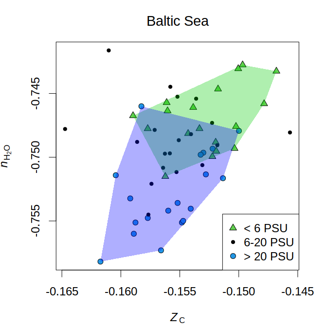

<!-- badges: start -->
[](https://cran.r-project.org/package=chem16S)
[](https://doi.org/10.5281/zenodo.6793059)
[](https://github.com/jedick/chem16S/actions/workflows/R-CMD-check.yaml)
<!-- badges: end -->

*chem16S* generates chemical representations of microbial communities by combining taxonomic abundances of archaea and bacteria with reference sequences for proteins.
Chemical metrics for community reference proteomes are used to investigate genomic adaptations to environmental conditions.
Potential applications range from human microbiomes to Earth-life coevolution.

* Read the paper in *Bioinformatics*: [*chem16S*: community-level chemical metrics for exploring genomic adaptation to environments](https://doi.org/10.1093/bioinformatics/btad564).

* View the [manual](https://chnosz.net/chem16S/manual/) and vignettes: [Chemical metrics of reference proteomes for taxa](https://chnosz.net/chem16S/vignettes/metrics.html), [Integration of *chem16S* with *phyloseq*](https://chnosz.net/chem16S/vignettes/phyloseq.html), and [Plotting two chemical metrics](https://chnosz.net/chem16S/vignettes/plotting.html).

### Methods

The user provides taxonomic classifications of high-throughput 16S rRNA gene sequences.
These are combined with reference proteomes for archaea and bacteria to obtain the amino acid compositions of **community reference proteomes**.
Amino acid compositions used to calculate chemical metrics including **carbon oxidation state** (*Z*<sub>C</sub>) and **stoichiometric hydration state** (*n*H<sub>2</sub>O).

Supported input formats:
* `phyloseq-class` objects created using [*phyloseq*](https://doi.org/doi:10.18129/B9.bioc.phyloseq)
* [RDP Classifier](https://sourceforge.net/projects/rdp-classifier/) output

Supported reference databases:

* [Genome Taxonomy Database](https://gtdb.ecogenomic.org/) (GTDB release 220)
* [NCBI Reference Sequence Database](https://www.ncbi.nlm.nih.gov/refseq/) (RefSeq release 206)
* Scripts used to generate reference proteomes for genus- and higher-level archaeal and bacterial taxa (and viruses for RefSeq) are available in the [GTDB_220](inst/RefDB/GTDB_220) and [RefSeq_206](inst/RefDB/RefSeq_206) directories.

Details:

* The taxonomic classifier should be trained on *16S rRNA sequences from GTDB* so that taxon names are matched to GTDB reference proteomes available in *chem16S*.
Training files are available for [DADA2](https://doi.org/10.5281/zenodo.13984843) and the [RDP Classifier](https://doi.org/10.5281/zenodo.12525163).
* For taxonomic classifications made using the RDP training set (No. 18 07/2020, used in RDP Classifier version 2.13), *chem16S* includes manual mappings to the NCBI taxonomy described by [Dick and Tan (2023)](https://doi.org/10.1007/s00248-022-01988-9).

### Example

The Baltic Sea has a salinity gradient from freshwater to marine conditions.
Progressively lower *n*H<sub>2</sub>O of community reference proteomes along this gradient represent a genomically coded dehydration trend.

<!-- Default image is too big

-->
<a href="https://chnosz.net/chem16S/manual/plot_metrics.html"></a>

PSU stands for practical salinity units.
The sequence data analyzed for this plot was taken from [Herlemann et al. (2016)](https://doi.org/10.3389/fmicb.2016.01883) and the code to make this plot is available in the [help page for `chem16S::plot_metrics`](https://chnosz.net/chem16S/manual/plot_metrics.html).

### Installation

First install *phyloseq* from Bioconductor:

```
if(!require("BiocManager", quietly = TRUE)) install.packages("BiocManager")
BiocManager::install("phyloseq")
```

Then install the release version of *chem16S* from CRAN:

```
install.packages("chem16S")
```

Or use `install_github` from *remotes* or *devtools* to install the development version of *chem16S* from GitHub:

```
if(!require("remotes", quietly = TRUE)) install.packages("remotes")
remotes::install_github("jedick/chem16S", build_vignettes = TRUE)
```
