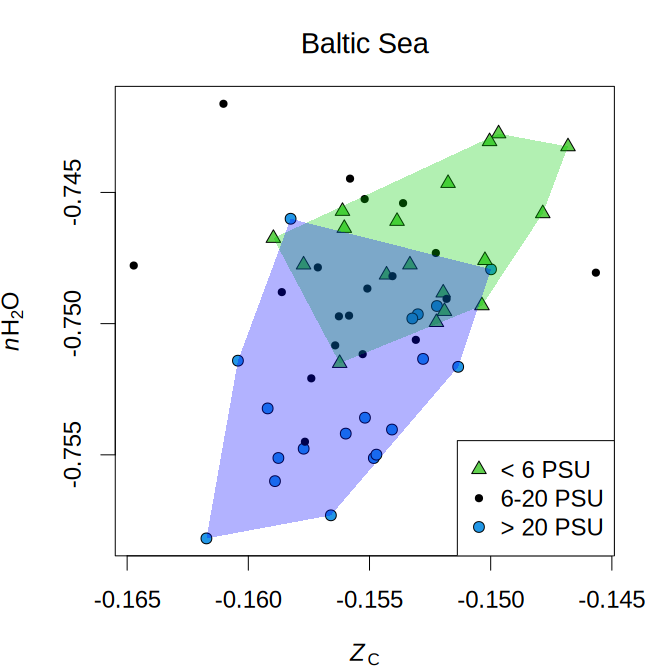

[](https://doi.org/10.5281/zenodo.6793059)

# chem16S

### Chemical metrics of community reference proteomes from taxonomic classifications

This R package implements the method described in [Dick and Tan (2023)](https://doi.org/10.1007/s00248-022-01988-9) for combining **RDP Classifier** output with **reference proteomes** of archaea and bacteria to generate the amino acid compositions of **community reference proteomes**.

The amino acid compositions of the community reference proteomes can be used to calculate chemical metrics such as **carbon oxidation state** (*Z*<sub>C</sub>) and **stoichiometric hydration state** (*n*<sub>H<sub>2</sub>O</sub>).
This example from the help page for the [`plot_metrics`](man/plot_metrics.Rd) function shows relatively low *n*<sub>H<sub>2</sub>O</sub> in high-salinity samples from the Baltic Sea with 16S rRNA gene sequencing data from [Herlemann et al. (2016)](https://doi.org/10.3389/fmicb.2016.01883).

<!-- Default image is too big

-->


### Reference proteomes for taxa

See README.txt and scripts in [`inst/extdata/RefSeq`](inst/extdata/RefSeq) for steps used to download protein sequences from the RefSeq database and calculate the total amino acid composition for each NCBI taxonomic ID (taxid).
The `taxon_AA.R` script generates the reference proteomes for each viral, archaeal and bacterial genus, family, order, class, and phylum in the RefSeq database as follows:

* Only taxids classified at the species level are used, and archaeal and bacterial species with less than 500 reference protein sequences are excluded;
* For each species-level taxid, the total amino acid composition is converted to per-protein mean amino acid composition (this is done so that species with different proteome sizes contribute equally to the reference proteomes of higher-level taxa);
* For each genus, the mean amino acid compositions of all species-level taxids in that genus are summed and divided by the number of taxids to get the amino acid composition of the reference proteome;
* Analogously, the mean amino acid compositions of all species-level taxids in each family, order, class, and phylum are used to get the reference proteomes for taxa at those levels.

### Installation

<!-- If you don't have it already, first install the **remotes** package from CRAN, then use that to install **chem16S** from GitHub. -->
As of 2023-06-17, **chem16S** depends on the development version of **canprot** from GitHub, not the released version on CRAN.

```
# Skip this if you already have 'remotes' installed
install.packages("remotes")

remotes::install_github("jedick/canprot")
remotes::install_github("jedick/chem16S")
```

[**phyloseq**](https://doi.org/10.18129/B9.bioc.phyloseq) is an optional but recommended dependency that is needed to build some of the vignettes in **chem16S**.

```
# Skip this if you already have 'BiocManager' installed
install.packages("BiocManager")

BiocManager::install("phyloseq")
remotes::install_github("jedick/chem16S", build_vignettes = TRUE)
```
